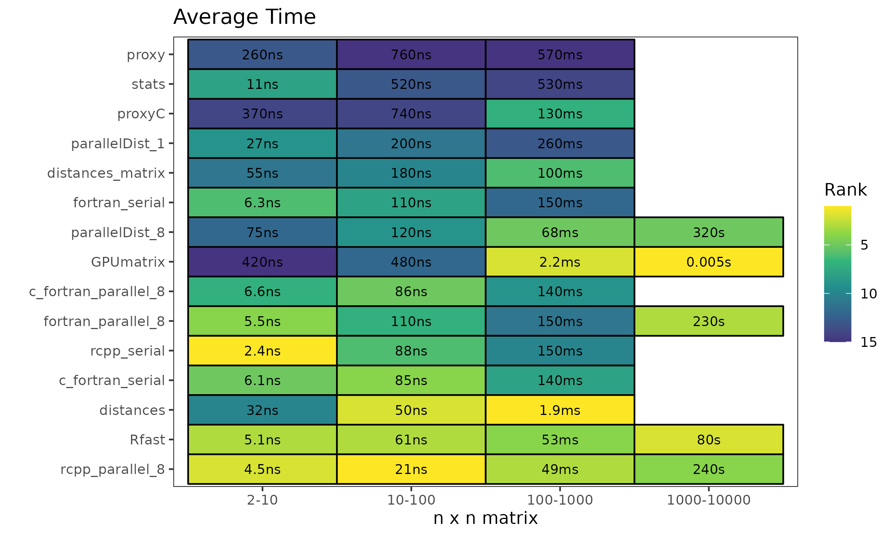

# R Distance Functions Comparison

## Overview
This repository evaluates the performance of several R euclidean distance functions from different packages. 

### Included Implementations
- [`stats`](https://www.rdocumentation.org/packages/stats/versions/3.6.2/topics/dist)
- [`proxy`](https://cran.r-project.org/web/packages/proxy/proxy.pdf)
- [`proxyC`](https://cran.r-project.org/web/packages/proxyC/proxyC.pdf)
- [`Rfast`](https://cran.r-project.org/web/packages/Rfast/Rfast.pdf)
- [`parallelDist`](https://cran.r-project.org/package=parallelDist)
- [`GPUmatrix`](https://cran.r-project.org/package=GPUmatrix)
- [`Rcpp`](https://www.rcpp.org/)
- fortran (not an R package)

## Results

An in-depth discussion of the results can be found in this blog [post]()

### Euclidean Distance
the fastest R functions to calculate euclidean distance between rows of matrices for different sizes are;

* 2 to 10 rows - Rcpp 
* 10 to 100 rows - Rcpp with parallelization 
* 100 to 1000 rows - GPUmatrix
* 1000 to 10000 rows - GPUmatrix

For matrix crossproduct calculation, `%*%` is fastest. For larger matrices, GPUmatrix again takes the lead.

### Matrix multiplication

## Methods

Function timings were made using [`bench`](https://bench.r-lib.org/). 

Square matrices of size n x n were used for each test. 

For matrices size 10-1000, 1000 iterations were used to time each function. 
The Median time was plotted for each matrix size. 
For summarized results, I calculated the average median time over the range of summarizes results. For example, the summarized time shown for matrix sizes 10-100 is the averaged median time for each matrix 10, 20, 30, 40, 50, 60, 70, 80, 90, 100.

Data manipulation and plotting was done with ggplot and tidyverse.

## System 
CPU: AMD Ryzen 5 5600X 6-Core Processor 3.70 GHz

GPU: NVIDIA GeForce RTX 2080 SUPER

OS: Ubuntu 22.04

R Version: 4.3.3

## License

This project is open-sourced under the MIT License.
